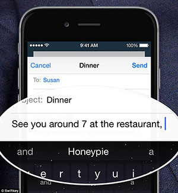

## This Is A Predictive Text Web Application For The Coursera Data Science Capstone Project.

******
________________________________________________________________________________________________
## Objective:
________________________________________________________________________________________________

* The main goal of this capstone project is to build a web app that predict's the next word after a sequence of inputted words.
* This app has a rudimentary prediction engine like the one used in mobile phones that predict the next word you might type:

******
________________________________________________________________________________________________
## How To Use The Web App:
________________________________________________________________________________________________

* Type (or copy and paste) in a word or phrase into the input text box on the main screen of the app. 
* The web app will sense that something new has been entered into the text box and it'll run your text input through it's prediction engine. 
* That's it!
* Each time the input changes, the app will try to make a prediction.

******
________________________________________________________________________________________________
## How It Works Under The Hood:
________________________________________________________________________________________________

* The data used to create a frequency dictionary originated in text a corpus called [HC Corpora](http://www.corpora.heliohost.org/). 
* 01) Create a sample data set from the corpus
* 02) Clean the sample (convert it to lowercase, remove punctuation, strip whitespace, remove entities, etc.) 
* 03) Tokensize the sample into N-Grams (see below for more on N-Grams)
* 04) Take the uni/bi/tri and quadram frequencies and put them into lookup data frames
* 05) Use the data frame to predict the next word in the inputted sequence.

******

________________________________________________________________________________________________
## Note On N-Grams:
________________________________________________________________________________________________

* What is an N-Gram? -->  [N-Grams](http://en.wikipedia.org/wiki/N-gram). 

*  *"In the fields of computational linguistics and probability, an N-Grams is a contiguous sequence of n items from a given sequence of text or speech." ([Wikipedia](http://en.wikipedia.org/wiki/N-gram))*